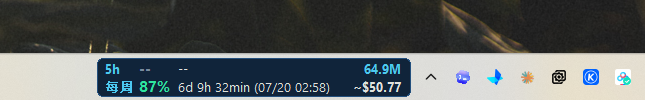
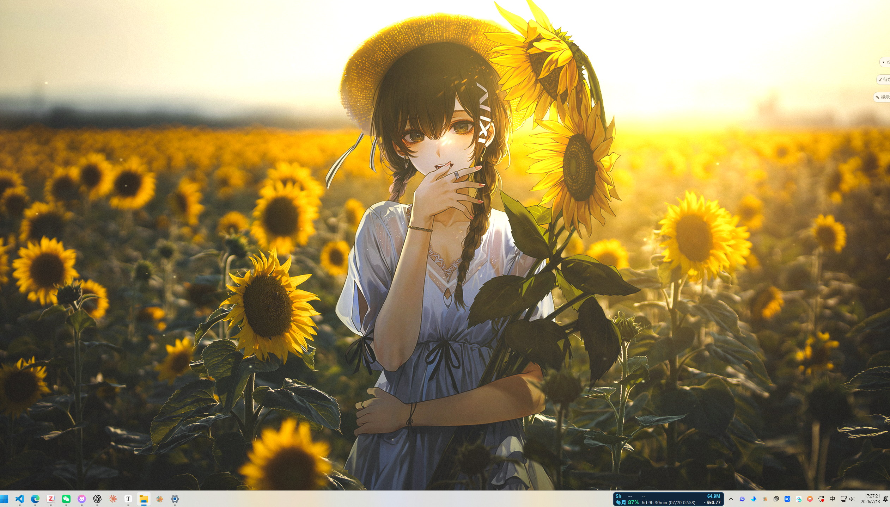
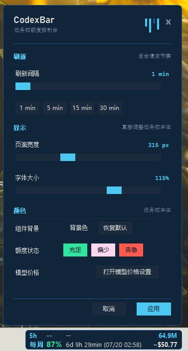
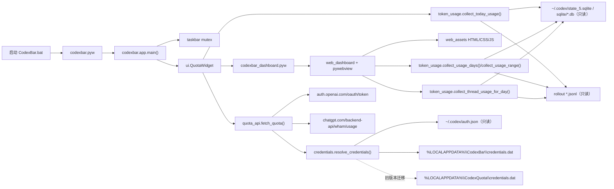

# CodexBar

[English](README_EN.md) | 简体中文

`CodexBar` 是一个免安装的 Windows 任务栏小组件。它把 Codex 额度、今日 token 和 API
等价花费固定显示在系统托盘旁边，不用反复打开网页或翻找本地日志。

<p align="center">
  
</p>

## 主要功能

- **任务栏常驻**：直接看到服务端当前提供的额度窗口、剩余百分比和重置时间。
- **今日用量**：在任务栏右侧显示今日 token 总量和 API 等价花费估算。
- **Token 账本**：按日查看输入、缓存输入、输出和推理 token，并切换每周、每月、每年趋势。
- **对话排行**：查看选中日期里每个 Codex 对话的 token、花费、模型、目录和消息数。
- **多账号切换**：保存多个 ChatGPT OAuth 账号，在右键菜单中切换当前额度账号。
- **高度可定制**：调整组件长度、字体大小、刷新间隔、背景色和额度状态颜色，修改时实时看到效果。
- **本地优先**：只读分析 Codex SQLite 和 rollout；不包含遥测、广告或远程日志上传。

> [!IMPORTANT]
> CodexBar 是社区维护的开源项目，非 OpenAI 官方产品，也未获得 OpenAI 认可或背书。
> 项目不包含遥测、广告或远程日志上传。额度查询使用 ChatGPT 的未公开接口，Codex
> 本地日志格式也不是稳定的公共 API；上游变化可能导致额度或 token 统计暂时不可用。
> 页面中的美元金额只是按公开 API 单价计算的等价估算，不是订阅账单或实际扣费。

## 下载后直接使用

CodexBar 是便携版应用，不需要安装 Python，也没有传统安装向导：

1. 打开 [GitHub Releases](https://github.com/Silver-Ray/CodexBar/releases)，下载最新的
   `CodexBar-Windows-x64.zip`。
2. 右键 ZIP 选择“全部解压”。
3. 打开解压后的 `CodexBar` 文件夹，双击 `CodexBar.exe`。

程序优先显示在任务栏系统托盘区域左侧的空位，自动避开应用图标和 Traffic Monitor 等
任务栏组件。空间不足时折叠为两行，仅显示 5h 和每周剩余额度；鼠标悬停后展开完整信息，
移开后收起，空位恢复后自动完整显示。若连折叠条也放不下或暂时无法读取布局，则提供
CodexBar 托盘入口，悬停查看详情。顶部或侧边任务栏也使用此入口。
额度条嵌入任务栏，打开开始菜单、系统搜索或时间菜单时保持可见，关闭面板无需等待恢复。
任务栏绘制与设置、菜单使用独立 UI 线程，避免任务栏宿主阻塞面板操作；用量窗口恢复使用异步请求。

支持高 DPI 原生绘制：系统缩放为 125%、150%、200% 等比例时，字体和布局按实际像素
重新绘制，避免 Windows 放大低分辨率窗口造成文字模糊。修改显示缩放或切换主屏后，
任务栏组件会自动更新；已有宽度和字号设置保持不变。

请保留解压后的整个 `CodexBar` 文件夹，不要只把
`CodexBar.exe` 单独拿出来，因为 HTML 页面和 Python 运行库也在这个文件夹中。

> [!NOTE]
> **首次运行可能出现 Windows SmartScreen 提示。** CodexBar 当前尚未使用商业代码签名
> 证书，因此 Windows 可能显示“发布者未知”“Windows 已保护你的电脑”或“目前无法访问
> SmartScreen”。该提示本身不是 CodexBar 的启动错误，也不等同于 Windows 已判定程序含有
> 病毒；它表示 Windows 无法验证 EXE 的发布者身份或查询应用信誉。
>
> 仅在确认 ZIP 下载自本仓库的 [GitHub Releases](https://github.com/Silver-Ray/CodexBar/releases)
> 后继续运行：看到“Windows 已保护你的电脑”时选择“更多信息 → 仍要运行”；看到“目前无法
> 访问 SmartScreen”时选择“运行”。不要运行来自第三方网盘、群聊或经过重新打包的版本。

SHA-256 校验是可选的高级安全步骤，放在后面的“安全说明”中，不影响普通用户直接使用。

## 第一次使用

1. 如果 Codex 已经使用 ChatGPT OAuth 登录，启动后等待一次刷新即可自动读取账号。
2. 如果显示 `AUTH`，先在终端运行 `codex login --device-auth`，按提示完成网页登录，再通过
   右键菜单选择“立即刷新”。
3. 单击组件打开 Token 用量面板；双击组件打开设置；右键组件打开完整菜单。

CodexBar 捕获 OAuth 账号后会使用 Windows DPAPI 加密保存。以后即使切换成 API key 登录，
仍可以继续查看已保存账号的额度；如果服务端撤销登录，则会显示 `RELOGIN`。

## 常用操作

- `单击`：打开 Token 用量面板；面板已打开时恢复并显示现有窗口。
- `双击`：打开设置窗口。
- `右键 → Token 用量...`：查看每日账单、趋势图和对话排行。
- `右键 → 立即刷新`：立即刷新额度和今日 token。
- `右键 → 账号`：切换当前显示额度的账号。
- `右键 → 设置...`：调整显示和刷新方式。
- `右键 → 打开错误日志...`：排查偶发的 `ERR`。

## 个性化设置

打开 `设置...` 后可以直接调整任务栏上的实际组件：

- 组件长度：`250-440px`，默认 `300px`。
- 字体大小：`80%-130%`，默认 `100%`。
- 刷新间隔：`1-120min`，并提供 `1 / 5 / 15 / 30min` 快捷值。
- 组件背景：选择任意合法十六进制颜色，普通文字会自动切换深浅以保持可读。
- 状态颜色：分别设置额度充足、偏少和告急时的数字颜色。
- 模型价格：每日从 OpenAI 官网更新模型与价格，也可以手动覆盖；离线使用缓存。

长度、字体和颜色在调整时会实时反映到 CodexBar 本体；点击“取消”会恢复原样，点击“应用”
才会保存到下次启动。

## 效果展示

### 桌面效果



### 设置界面

<p align="center">
  
</p>

## 从源码运行（开发者）

普通用户不需要执行本节命令；Releases 中的 ZIP 已经包含打包完成的 EXE 和运行环境。

需要 Windows 10/11、[uv](https://docs.astral.sh/uv/) 和 Git。克隆仓库后双击：

```text
启动 CodexBar.bat
```

也可以直接运行：

```powershell
uv sync --frozen
uv run --frozen pythonw .\codexbar.pyw
```

程序使用 Windows named mutex，所以重复启动时会保留旧实例，新进程静默退出。
启动脚本会优先使用项目本地 `.venv`。如果 `.venv` 不存在且系统安装了 `uv`，
脚本会先执行 `uv sync --frozen`，严格按 `uv.lock` 安装依赖，再启动 CodexBar。
启动脚本不会修改系统 Python、Miniconda 或其它项目的环境。

只有维护者修改源码并准备发布新版本时，才需要重新运行 PyInstaller。构建命令、发布产物和
安全检查见 [.github/CONTRIBUTING.md](.github/CONTRIBUTING.md)。

## 建议阅读顺序

1. `codexbar.pyw`：启动入口，只有几行代码。
2. `codexbar/app.py`：应用生命周期和模块组装。
3. `codexbar/config.py`：路径、设置、颜色和迁移辅助逻辑。
4. `codexbar/credentials.py`：OAuth 捕获、多账号 DPAPI vault、旧路径迁移。
5. `codexbar/quota_api.py`：token 刷新和额度接口请求。
6. `codexbar/token_usage.py`：只读统计今日/周期 token，并按 API 价格估算花费。
7. `codexbar/diagnostics.py`：本地轮转日志、统一脱敏和诊断导出。
8. `codexbar/web_dashboard.py`：WebView Token 用量账本的数据 API 和窗口入口。
9. `codexbar/taskbar.py`：Win32 任务栏定位和单实例保护。
10. `codexbar/ui.py`：任务栏小组件、设置窗口、右键菜单和后台刷新。
11. `codexbar/web_assets/`：账本窗口的 HTML/CSS/JS。
12. [docs/ARCHITECTURE.md](docs/ARCHITECTURE.md)：完整的数据流、依赖方向和安全边界。

## 项目结构

```text
CodexBar/
├── .github/
│   ├── workflows/
│   ├── ISSUE_TEMPLATE/
│   ├── CODE_OF_CONDUCT.md
│   ├── CONTRIBUTING.md
│   └── SECURITY.md
├── docs/
│   ├── ARCHITECTURE.md
│   └── PRIVACY.md
├── codexbar.pyw
├── codexbar_dashboard.pyw
├── CodexBar.spec
├── 启动 CodexBar.bat
├── scripts/
│   ├── audit_release.py
│   ├── build_exe.ps1
│   └── collect_licenses.py
├── LICENSE
├── THIRD_PARTY_NOTICES.md
├── pyproject.toml
├── uv.lock
├── codexbar/
│   ├── __init__.py
│   ├── app.py
│   ├── config.py
│   ├── credentials.py
│   ├── diagnostics.py
│   ├── quota_api.py
│   ├── runtime.py
│   ├── taskbar.py
│   ├── token_usage.py
│   ├── ui.py
│   ├── version_info.txt
│   ├── web_assets/
│   └── web_dashboard.py
├── third_party_licenses/
└── test_codexbar.py
```

## 启动与数据流



## 迁移说明

- 当前配置路径：`%LOCALAPPDATA%\CodexBar\config.json`
- 旧配置路径：`~/.codex/.codexbar_cfg.json`、`~/.codex/.quota_widget_cfg.json`
- 旧凭据路径：`%LOCALAPPDATA%\CodexQuota\credentials.dat`
- 新凭据路径：`%LOCALAPPDATA%\CodexBar\credentials.dat`

首次运行时，如果当前配置或新 vault 不存在，而旧文件存在，CodexBar 会自动执行一次迁移，
之后只继续使用新路径。旧文件不会被强制删除，这样你仍然可以手动回退。

其中 vault 迁移不是简单复制文件。因为旧 vault 使用的是旧的 DPAPI 附加熵，
所以 CodexBar 会先用旧熵解密，再用新的 `CodexBar:v1` 重新加密保存。

## 多账号

CodexBar 的 vault 现在可以保存多个账号。每次检测到新的 OAuth 登录时：

1. 如果是新 `account_id`，会加入账号列表。
2. 如果是已有 `account_id`，会更新该账号的 token。
3. 新捕获或更新的 OAuth 账号会自动变成当前显示账号。

当你切换回 API key 登录、`auth.json` 暂时缺失或格式异常时，CodexBar 不会删除账号，
而是继续用当前选中的账号查询额度。右键小组件可以打开账号菜单：

- `账号`：切换当前显示账号。
- `清除当前账号`：只删除当前选中的账号；如果还有其他账号，会自动切到剩余账号。
- `清除所有账号`：删除整个加密 vault。
- `Token 用量...`：打开本机 token 账本主页面。

如果某个账号的 refresh token 被服务端撤销，只会影响当前账号并显示 `RELOGIN`；
你仍然可以右键切换到其他已保存账号。

## 额度请求流程

`quota_api.fetch_quota()` 的工作顺序是：

1. 解析当前选中的 OAuth 凭据。
2. 检查 JWT 里的 `exp` 过期时间。
3. 即将过期时自动刷新 token。
4. 使用严格 TLS 校验访问 `https://chatgpt.com/backend-api/wham/usage`。
5. 把 `used_percent` 转换成剩余百分比和重置时间。

`wham/usage` 是 ChatGPT 使用的未公开接口，不属于承诺稳定的 OpenAI 公共 API。
CodexBar 会把缺失的窗口显示为 `--`，但上游字段、认证方式或访问策略变化仍可能需要更新程序。

小组件会常驻显示两行：

- `5h -- -- 116.3M`（当前服务端未提供 5h 窗口时）
- `每周 79% 6d 17h 24min (07/07 16:08) $31.42`

## 设置

右键小组件选择 `设置...`，可以修改：

- 页面宽度：默认 `300px`，可在 `250-440px` 之间调整。
- 字体大小：默认 `100%`，可在 `80%-130%` 之间调整；拖动滑块时任务栏小组件会实时预览，点 `取消` 不保存。
- 刷新间隔：控制额度和今日 token 统计的后台刷新节奏。
- 组件背景：只修改任务栏小组件本体，选择颜色后会立即实时显示；点 `取消` 或关闭设置窗口会恢复原颜色，点 `应用` 后才持久化。
- 数字颜色：分别控制额度充足、偏少、告急时的百分比颜色。
- 模型价格：点击 `模型价格...` 打开价格表编辑窗口。

任务栏组件的重置时间和美元金额会根据背景亮度自动使用深色或浅色文字。透明键色
`#FF00FE` 不允许作为组件背景，Token 用量页面和设置窗口本身不会跟随组件背景改变。

模型价格窗口显示最近同步的官方价格，并可滚动浏览新增模型。空白表示不覆盖官方价格；保存后只会把你改过的模型写入
`%LOCALAPPDATA%\CodexBar\model_prices.json`。点击 `恢复官方价格` 会删除本地覆盖文件，
并在下次刷新时重新按最新缓存的官方价格计算。

## Token 用量主页面

单击小组件或右键选择 `Token 用量...` 会打开一个独立 WebView 窗口。这个页面定位成“本机 Codex token 账本”，
不影响任务栏小组件常驻显示。任务栏小组件仍然由 Tk 负责；账本窗口用 `pywebview` 嵌入 HTML/CSS/JS。
账本窗口默认按宽屏数据台设计，默认宽度约 `1720px`，最小宽度约 `1600px`，用于完整显示右侧对话排行字段。

打开账本时会先显示一个“数据扫描仪”加载层。后台会分阶段读取本机 Codex SQLite、扫描 rollout、
计算今天账单、整理今天对话排行和周趋势；前端通过 `start_initial_load()` / `get_load_status()`
轮询真实加载状态，并显示当前阶段、进度和 `扫描 rollout N/M` 这类细节。

页面提供三种周期：

- `每周`：最近 7 天，按天聚合。
- `每月`：当前自然月，按天聚合。
- `每年`：当前自然年，按月聚合。

左侧显示最近日期列表，每天一行显示日期、token 和估算花销；点击某一天后，中间显示那一天的账单收据。
账单收据把总 token、总花销放在最显眼的位置，并按输入、缓存、输出、推理拆分 token、百分比和价格。

主区域右侧是跟随日期变化的 `对话排行`。例如左侧点 `07/04`，右侧就只显示 `07/04` 当天产生 token 的对话。每个对话一行，不展开、不换行，字段包括：

- 对话名：优先使用 Codex 桌面端目录库里的 `local_thread_catalog.display_title`，因此会尽量显示你重命名后的标题；没有目录库标题时再回退到 `threads.title`、首条用户消息、预览或工作区目录名。
- 模型和目录：帮助判断是哪类任务或哪个项目产生的消耗。
- token、估算花销和 `I/C/O`：`I/C/O` 分别代表普通输入、缓存输入、输出的百分比。
- 消息数：从 rollout 里的用户消息事件估算；如果当前日志格式没有可识别的用户消息事件，则显示 `--`。

对话名太长时会单行省略为 `...`，鼠标悬停可以看到完整标题。

页面还提供：

- `刷新`：重新扫描本机 Codex 日志。
- `今天`：快速回到今天的账单。
- `每周 / 每月 / 每年`：切换底部趋势图。

## 今日 token 与花费估算

`token_usage.collect_today_usage()` 会只读打开 Codex 本地 SQLite，找到线程的 `rollout_path`，
再解析 rollout `.jsonl` 中的 `token_count` 事件。统计范围是本机全部 Codex 线程，
“今日”按 Windows 本地日期计算。

`token_usage.collect_usage_range()` 使用同一套只读数据源，但会按主页面选择的周期聚合。
SQLite 使用只读模式打开，rollout `.jsonl` 也只读取不写入。Codex 子任务可能把父任务历史
复制到新的 rollout。CodexBar 会读取 `session_meta` 判断派生任务和子任务，并在
`thread_settings_applied` 或 `inter_agent_communication` 接管边界之前只建立累计基线，
不把复制历史重复计入当天、趋势图和对话排行。

每条用量优先使用 `total_token_usage` 与上一条累计快照做非负差值；只有没有累计快照时，
才回退到 `last_token_usage`。这套口径对齐 CC Switch 当前源码中已经修复的算法。
CC Switch `3.16.5` 会优先把子任务的父 `session_id` 用作记录编号，多个子任务可能发生编号冲突并漏算，
因此该旧版本的结果可能比 CodexBar 偏低。如果文件正在被 Codex 写入或数据库短暂锁定，
本次扫描会跳过异常来源，不会修改 Codex 的运行状态。

今日分项价格由 `token_usage.estimate_event_cost_breakdown_usd()` 计算：

- `输入`：`input_tokens - cached_input_tokens`，按普通输入价格计费。
- `缓存`：`cached_input_tokens`，按 cached input 价格计费。
- `输出`：`output_tokens`，按 output 价格计费。
- `推理`：只显示 `reasoning_output_tokens` 数量，价格已包含在输出口径中，不额外重复计算。

官方表包括 GPT-6、GPT-5.6 等模型，并随官网新增模型自动更新。API 日志目前不提供独立的缓存写入 token 数量，
因此价格表里的“缓存写入”暂不参与估算；缓存命中的输入按“缓存输入”价格计算。

第一行右侧的 `116.3M` 表示今日 `total_tokens / 1,000,000`。第二行右侧的 `$31.42`
是按 OpenAI API Standard 价格估算的等价花费，不代表 ChatGPT Plus/Pro 订阅真实扣费。

价格表采用 OpenAI API Standard 口径，在后台每日同步一次官网公开文档，包含长上下文价格，
不会混用 Batch、Flex 或 Fast 价格。首次离线使用随程序附带的公开价格快照；同步失败时
保留上次成功缓存，一小时后重试。缓存保存为 `%LOCALAPPDATA%\CodexBar\official_model_prices.json`，
用量面板显示价格日期及离线状态。若要按自己的价格计算，可以点击 `模型价格...` 修改；
也可以手动创建：

```text
%LOCALAPPDATA%\CodexBar\model_prices.json
```

文件内容示例：

```json
{
  "gpt-5.5": {
    "input": 5.0,
    "cached_input": 0.5,
    "output": 30.0,
    "long_input": 10.0,
    "long_cached_input": 1.0,
    "long_output": 45.0
  }
}
```

官方价格来自 [OpenAI API 价格页面](https://developers.openai.com/api/docs/pricing)。
手动价格始终优先于官方更新；官网未提供折扣缓存价格的模型按普通输入价格估算缓存输入。

如果同一天同时包含已识别和未识别的模型，CodexBar 会保留已识别模型的计价小计，
并用 `~$12.34` 表示该金额不包含未知模型；只有全部记录都无法计价时才显示 `$--`。

## 安全说明

- 本工具对 `auth.json` 始终只读。
- 本工具对 Codex SQLite 和 rollout 日志也始终只读。
- token 不会以明文形式写入磁盘。
- vault 使用 Windows DPAPI 加密，并且只允许当前 Windows 用户解密。
- 多账号信息和当前选中的 `account_id` 都保存在同一个 DPAPI 加密 vault 中。
- 默认会严格校验 `auth.openai.com` 和 `chatgpt.com` 的 TLS 证书。
- 如果你的代理会重签 HTTPS，可以通过 `CODEXBAR_CA_BUNDLE` 指定代理 CA 证书路径。
  同时也兼容旧变量 `CODEX_QUOTA_CA_BUNDLE`，以及 `SSL_CERT_FILE`、
  `REQUESTS_CA_BUNDLE`、`CURL_CA_BUNDLE`。
- 设置文件采用同目录临时文件加原子替换；写盘失败时设置窗口会保留并显示错误，旧配置不会被截断。
- CodexBar 不包含遥测，不会上传对话标题、rollout、token 日报、模型价格或诊断日志。

完整的数据边界见 [docs/PRIVACY.md](docs/PRIVACY.md)，安全漏洞请按
[.github/SECURITY.md](.github/SECURITY.md) 私密报告。自动脱敏只是纵深保护；分享诊断前仍应人工检查。

<details>
<summary>可选：校验下载文件的 SHA-256</summary>

需要额外确认下载文件完整性时，再从 Releases 下载同版本的
`CodexBar-Windows-x64.zip.sha256`，然后在 ZIP 所在目录运行：

```powershell
(Get-FileHash .\CodexBar-Windows-x64.zip -Algorithm SHA256).Hash.ToLowerInvariant()
Get-Content .\CodexBar-Windows-x64.zip.sha256
```

两个 64 位十六进制值应完全相同。普通使用不要求执行这一步。

</details>

## ERR 诊断日志

任务栏小组件短暂显示 `ERR` 通常表示额度刷新线程遇到了未归类异常。常见来源包括：

- 代理或网络短暂失败。
- `auth.openai.com` 或 `chatgpt.com` 返回临时 HTTP 错误。
- OAuth token 刷新失败但还没进入明确的 `RELOGIN` 状态。
- 额度接口响应字段变化。
- 今日 token 统计读取本机 SQLite/rollout 时遇到短暂锁定或坏行。

CodexBar 会把这些异常写到：

```text
%LOCALAPPDATA%\CodexBar\error.log
```

右键小组件选择 `打开错误日志...` 可以直接打开该文件。日志是 JSONL，每行一条事件，
包含时间、阶段、异常类型、HTTP 状态和简短堆栈。日志会自动轮转为 `error.log.1`，
并且会脱敏 `access_token`、`refresh_token`、`id_token` 和 `Authorization` 内容。
也可以使用 `导出脱敏诊断...` 生成适合附到 Issue 的文本副本。

## 卸载

1. 右键退出 CodexBar，并删除解压后的程序目录或源码目录。
2. 删除 `%LOCALAPPDATA%\CodexBar`，清除 DPAPI 凭据、设置、价格和诊断日志。
3. 删除你创建的 `启动 CodexBar.lnk`。
4. 确认不需要回退旧版本后，可选择删除 `~/.codex/.codexbar_cfg.json`、
   `~/.codex/.quota_widget_cfg.json` 和旧 `%LOCALAPPDATA%\CodexQuota`。

CodexBar 不会删除 `~/.codex/auth.json`、Codex 数据库或 rollout 对话记录。

## 开源与贡献

- 许可证：[MIT LICENSE](LICENSE)
- 隐私说明：[docs/PRIVACY.md](docs/PRIVACY.md)
- 安全策略：[.github/SECURITY.md](.github/SECURITY.md)
- 贡献指南：[.github/CONTRIBUTING.md](.github/CONTRIBUTING.md)
- 第三方依赖：[THIRD_PARTY_NOTICES.md](THIRD_PARTY_NOTICES.md)
- 行为准则：[.github/CODE_OF_CONDUCT.md](.github/CODE_OF_CONDUCT.md)

提交 Issue 前请勿粘贴真实 token、账号 ID、`auth.json`、`credentials.dat`、原始 rollout
或未经人工检查的日志。贡献使用 DCO，提交时执行 `git commit -s`。

## 测试

```powershell
uv lock --check
uv run --frozen python -m unittest -q .\test_codexbar.py
uv run --frozen python -m compileall -q .\codexbar .\codexbar.pyw .\codexbar_dashboard.pyw .\test_codexbar.py
```

测试会使用临时 auth/config/vault 路径和假的 HTTP opener，不会碰你的真实 Codex 登录。

依赖由 `uv` 管理：

```powershell
uv sync --frozen --group build
```
