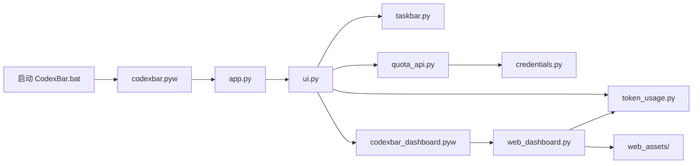

# CodexBar 架构说明

本文面向希望阅读或修改 CodexBar 的开发者，只描述当前实现。历史实施计划不属于运行时
文档，关键设计决策统一收敛在这里。

## 总体结构

CodexBar 由两个本地窗口组成：

- Tk 任务栏小组件：显示额度、今日 token 和估算花销，提供设置与账号菜单。
- pywebview 用量页面：使用 HTML、CSS 和 JavaScript 展示日期、对话排行和趋势图。



## 启动流程

1. `启动 CodexBar.bat` 使用 `uv.lock` 同步项目虚拟环境。
2. `codexbar.pyw` 调用 `codexbar.app.main()`。
3. `app.py` 获取 Windows named mutex，防止重复实例。
4. Tk 创建无边框任务栏窗口，`ui.py` 组装菜单和刷新线程。
5. `taskbar.py` 用 `FindWindowW` 直接查找主任务栏，避免开始/搜索面板打开时 `EnumWindows` 漏掉系统窗口。`taskbar_display.py` 在专用线程创建仅负责绘制的 Tk 根窗口，通过 `SetParent` 嵌入任务栏，使用不激活的子窗口样式和客户区坐标，共享系统窗口层级。应用主 Tk 根窗口始终独立且隐藏，设置、菜单和悬停详情由主线程处理；显示线程仅通过队列发送鼠标事件，主线程仅提交普通值组成的布局和绘制命令，不跨线程使用 Tk 对象。这样 Explorer 关联的输入队列不会阻塞应用面板的焦点操作。Explorer 退出销毁显示窗口时，仅重建显示线程的 Tk 窗口，保留已打开的设置与主实例。

任务栏每 500 ms 重新定位。`taskbar_accessibility.py` 通过后台 COM/UI Automation 探测
可见控件，每秒至多发起一次读取，同时只允许一个探测在途；缓存超过两秒、任务栏句柄或
尺寸变化、读取失败时均不假定有空位。时间右键菜单可能让 UIA 仅返回栏外菜单项；识别到这种菜单树时保留相同任务栏上一次的控件位置并继续探测，菜单关闭后直接使用新布局。首次启动无有效布局时不会凭空推断空位。UI Automation 坐标映射到 Tk 所用的任务栏坐标空间，
以适配显示缩放。`taskbar.py` 另外通过 `FindWindowExW` 直接遍历原生子窗口并探测栏内浮窗，避开 Traffic Monitor 等
自绘组件；对之前发现的原生浮窗继续检查实时句柄、进程、类名、可见性和位置，避免系统面板打开时漏枚举而覆盖 Traffic Monitor。任务栏身份或尺寸变化会清除这些记录。优先选取靠右且能容纳完整宽度的连续空位，放不下则尝试 96 逻辑像素宽的
折叠条，仍保持原字号，仅绘制两行额度；空间恢复后自动完整显示。鼠标停留 150 ms 后
在桌面侧显示独立详情窗口，移开 250 ms 后收起，允许鼠标从折叠条进入详情窗口。
完全没有安全空位或无法识别布局时，`tray.py` 通过原生 Shell_NotifyIcon 提供悬停、刷新、
设置和右键菜单入口，并在 Explorer 重启后重新注册图标；不修改其他组件的窗口尺寸。

`app.manifest` 为打包程序声明 Per-Monitor V2 DPI awareness 与 Windows 8+ 兼容性，后者允许任务栏中的透明子窗口参与合成。显示线程在原生嵌入完成后重新设置透明色，确保实际绘制可见而不只是保留鼠标命中区域。源码入口在创建 Tk 前通过
`dpi.py` 启用相同模式。配置尺寸保持 96-DPI 逻辑单位，绘制和 Win32 定位使用当前主任务栏
DPI 对应的实际像素。字体使用负数 Tk 字号（像素）避免 Tk 全局点数换算造成二次缩放。
任务栏定时定位也检查 DPI 变化并重建字体；设置窗口的坐标、嵌入控件和字体同步缩放。

源码模式下，用量页面由 `codexbar_dashboard.pyw` 启动；PyInstaller 模式下由同一个
`CodexBar.exe --dashboard` 启动。

## 额度数据流

```text
auth.json（只读）
    ↓
credentials.py → DPAPI 多账号 vault
    ↓
quota_api.py → ChatGPT usage 接口
    ↓
ui.py → 周额度或错误状态
```

`credentials.py` 只读取 `~/.codex/auth.json`。完整 OAuth 登录会被复制进当前 Windows
用户可解密的 DPAPI vault；API key 登录、退出或临时损坏不会自动清空已保存账号。
刷新 access token 时只更新 CodexBar 自己的 vault，不修改 Codex 文件。

额度接口属于未公开接口，响应字段可能变化。缺少短周期额度时，UI 用 `--` 保持双行布局，
周额度仍独立显示。

## Token 数据流

`token_usage.py` 以只读方式打开 Codex SQLite，取得唯一的 rollout 路径，然后解析 JSONL
中的 `token_count` 事件。统计按 Windows 本地日期聚合，不写入 Codex 数据库或 rollout。

计价规则：

- 普通输入：`input_tokens - cached_input_tokens`。
- 缓存输入：`cached_input_tokens`。
- 输出：`output_tokens`；推理 token 已包含在输出口径中，不重复收费。
- 未识别模型仍计入 token。混合已知和未知模型时显示 `~$金额`；全部无法计价时显示 `$--`。

为了避免重复解析，rollout 结果按文件路径、大小和修改时间缓存在内存中。所有扫描都在后台
线程执行，Tk 更新通过 `root.after()` 回到主线程。

`pricing.py` 在额度刷新及 WebView 初始加载的后台线程中每日读取一次官网公开 Markdown
价格表，只解析 Standard 的按百万文本 token 计价列，排除缓存写入、音频、图片、训练及
Batch/Flex/Fast 表。解析成功后通过临时文件和原子替换保存缓存，新模型自动进入可滚动的
价格设置列表。失败时保留原缓存并限流重试；首次离线使用打包的公开价格快照。
手动价格覆盖最后合并，优先于官网数据。计价缓存检查官方/手动价格文件的修改时间，
即使另一个进程更新价格也会立即重新估算。单击延迟至系统双击判定间隔结束后打开账本，
双击则取消单击回调并打开设置；账本已运行时恢复现有窗口。

## WebView 边界

`web_dashboard.py` 只向页面暴露统计、刷新、复制摘要和价格设置等有限 API。页面资源来自
`codexbar/web_assets`，WebView 使用私有模式；导航离开内置本地页面时窗口会被关闭。

页面显示的对话标题、模型、工作目录末级名称和 token 汇总只在本机处理，不会由 CodexBar
上传。完整隐私边界见 [PRIVACY.md](PRIVACY.md)。

## 本地数据

CodexBar 自有文件位于 `%LOCALAPPDATA%\CodexBar`：

- `credentials.dat`：DPAPI 加密账号 vault。
- `config.json`：显示与刷新设置。
- `model_prices.json`：可选价格覆盖。
- `official_model_prices.json`：公开价格表的成功同步缓存。
- `error.log`、`error.log.1`：限制大小且经过脱敏的诊断日志。

`config.py` 集中管理路径和配置迁移，`runtime.py` 隔离源码与 PyInstaller 资源路径差异。

## 安全边界

- TLS 证书和主机名校验默认开启；代理证书通过用户显式配置的 CA 信任。
- `auth.json`、Codex SQLite 和 rollout 始终只读。
- token、Authorization、账号 ID 和本机绝对路径不得写入诊断日志。
- WebView 不加载远程页面，CodexBar 不包含遥测或远程日志上传。
- DPAPI 保护静态凭据，但不能抵御已经控制当前 Windows 用户会话的攻击者。

## 构建与发布

`CodexBar.spec` 描述 PyInstaller one-folder 构建，`scripts/build_exe.ps1` 负责：

1. 清理旧构建目录。
2. 按 `uv.lock` 运行固定版本 PyInstaller。
3. 收集隐私、安全和第三方许可证文件。
4. 执行发布隐私审计。
5. 生成 ZIP 和 SHA-256 文件。

构建审计通过 `--verify-python-runtime` 将 `_internal` 下的 Python DLL/PYD 与构建解释器
原始文件逐字节核对；仅完全一致的原生运行库可保留上游编译机路径。修改过的二进制、
应用文件和所有凭据匹配仍会被拦截。独立调用审计时默认仍严格检查全部路径。

GitHub Actions 的 CI 在 main 推送、PR 和手动触发时运行全部测试、源码编译和 Windows 构建审计，并保留 ZIP 与 SHA-256 构建产物。Release 工作流在 `v*` 标签推送时验证标签和项目版本一致，完整检查通过后发布到当前仓库的 Releases；`docs/releases/<tag>.md` 提供对应版本的发布说明。工作流使用固定 SHA 的 Actions 和最小权限，原生命令失败会停止发布。
