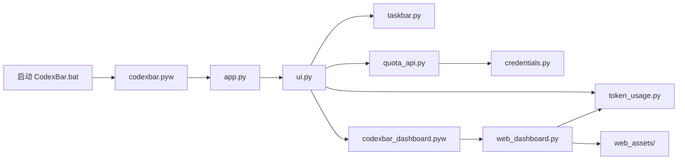

# CodexBar 架构说明

本文面向希望阅读或修改 CodexBar 的开发者，只描述当前实现。历史实施计划不属于运行时
文档，关键设计决策统一收敛在这里。

## 总体结构

CodexBar 由两个本地窗口组成：

- Tk 任务栏小组件：显示额度、今日 token 和估算花销，提供设置与账号菜单。
- pywebview 用量页面：使用 HTML、CSS 和 JavaScript 展示日期、对话排行和趋势图。



## 启动流程

1. `启动 CodexBar.bat` 使用 `uv.lock` 同步项目虚拟环境。
2. `codexbar.pyw` 调用 `codexbar.app.main()`。
3. `app.py` 获取 Windows named mutex，防止重复实例。
4. Tk 创建无边框任务栏窗口，`ui.py` 组装菜单和刷新线程。
5. `taskbar.py` 查找主任务栏通知区域，并维持 owned-popup 与 Z-order；周期定位会比较窗口与任务栏的实际层级，仅在截图遮罩或 Explorer 把组件压到任务栏下方时重新提升。

源码模式下，用量页面由 `codexbar_dashboard.pyw` 启动；PyInstaller 模式下由同一个
`CodexBar.exe --dashboard` 启动。

## 额度数据流

```text
auth.json（只读）
    ↓
credentials.py → DPAPI 多账号 vault
    ↓
quota_api.py → ChatGPT usage 接口
    ↓
ui.py → 周额度或错误状态
```

`credentials.py` 只读取 `~/.codex/auth.json`。完整 OAuth 登录会被复制进当前 Windows
用户可解密的 DPAPI vault；API key 登录、退出或临时损坏不会自动清空已保存账号。
刷新 access token 时只更新 CodexBar 自己的 vault，不修改 Codex 文件。

额度接口属于未公开接口，响应字段可能变化。缺少短周期额度时，UI 用 `--` 保持双行布局，
周额度仍独立显示。

## Token 数据流

`token_usage.py` 以只读方式打开 Codex SQLite，取得唯一的 rollout 路径，然后解析 JSONL
中的 `token_count` 事件。统计按 Windows 本地日期聚合，不写入 Codex 数据库或 rollout。

计价规则：

- 普通输入：`input_tokens - cached_input_tokens`。
- 缓存输入：`cached_input_tokens`。
- 输出：`output_tokens`；推理 token 已包含在输出口径中，不重复收费。
- 未识别模型仍计入 token。混合已知和未知模型时显示 `~$金额`；全部无法计价时显示 `$--`。

为了避免重复解析，rollout 结果按文件路径、大小和修改时间缓存在内存中。所有扫描都在后台
线程执行，Tk 更新通过 `root.after()` 回到主线程。

## WebView 边界

`web_dashboard.py` 只向页面暴露统计、刷新、复制摘要和价格设置等有限 API。页面资源来自
`codexbar/web_assets`，WebView 使用私有模式；导航离开内置本地页面时窗口会被关闭。

页面显示的对话标题、模型、工作目录末级名称和 token 汇总只在本机处理，不会由 CodexBar
上传。完整隐私边界见 [PRIVACY.md](PRIVACY.md)。

## 本地数据

CodexBar 自有文件位于 `%LOCALAPPDATA%\CodexBar`：

- `credentials.dat`：DPAPI 加密账号 vault。
- `config.json`：显示与刷新设置。
- `model_prices.json`：可选价格覆盖。
- `error.log`、`error.log.1`：限制大小且经过脱敏的诊断日志。

`config.py` 集中管理路径和配置迁移，`runtime.py` 隔离源码与 PyInstaller 资源路径差异。

## 安全边界

- TLS 证书和主机名校验默认开启；代理证书通过用户显式配置的 CA 信任。
- `auth.json`、Codex SQLite 和 rollout 始终只读。
- token、Authorization、账号 ID 和本机绝对路径不得写入诊断日志。
- WebView 不加载远程页面，CodexBar 不包含遥测或远程日志上传。
- DPAPI 保护静态凭据，但不能抵御已经控制当前 Windows 用户会话的攻击者。

## 构建与发布

`CodexBar.spec` 描述 PyInstaller one-folder 构建，`scripts/build_exe.ps1` 负责：

1. 清理旧构建目录。
2. 按 `uv.lock` 运行固定版本 PyInstaller。
3. 收集隐私、安全和第三方许可证文件。
4. 执行发布隐私审计。
5. 生成 ZIP 和 SHA-256 文件。

GitHub Actions 的 CI 运行编译、测试和发布审计；Release 工作流只在版本标签触发，并使用
最小权限构建 Windows 产物。
